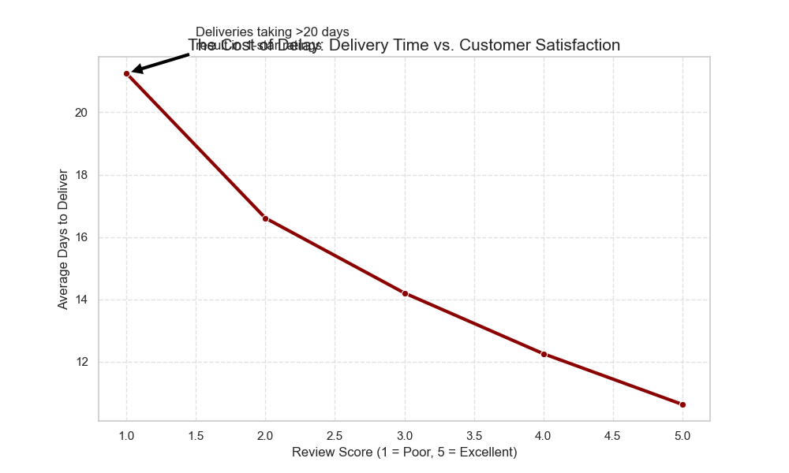

# 📦 Olist Marketplace Funnel Analytics
**Optimizing Customer Retention through Logistics Intelligence**

## 🎯 Executive Summary
This project investigates the operational bottlenecks of the Olist Brazilian E-Commerce marketplace using a dataset of 100k+ orders. By architecting a local data warehouse and engineering a multi-stage fulfillment funnel, I identified that **carrier transit delays** are the primary driver of the platform's low **3.12% retention rate**.

### 💡 Key Findings
* **The Retention Crisis:** Only **3.12%** of the customer base are repeat buyers, indicating a high-acquisition, low-loyalty business model.
* **The Fulfillment Bottleneck:** Average delivery takes **12.5 days**; carrier transit time accounts for **74%** of this delay (9.3 days).
* **The Satisfaction Threshold:** There is a direct linear correlation between delivery speed and review scores. To maintain a 4.5+ star rating, deliveries must occur within an **11-day window**.
* **Regional Disparity:** I identified a **236% variance** in delivery performance between the Southeast (São Paulo) and Northern regions (Roraima/Amapá).

---

## 🛠️ Tech Stack
* **Database:** DuckDB (High-performance OLAP engine)
* **Language:** Python 3.9 (Pandas, Seaborn, Matplotlib)
* **Environment:** VS Code + Jupyter Notebooks
* **Version Control:** Git/GitHub

---

## 🏗️ Project Architecture: The Medallion Approach
I implemented a structured data pipeline to ensure scalability and performance:
1.  **Bronze Layer:** Raw CSV ingestion from Kaggle into a persistent `olist.db` file.
2.  **Silver Layer:** SQL-transformed tables to handle timestamp parsing and relational joins between orders, sellers, and customers.
3.  **Gold Layer:** Business-logic views calculating GMV, Lead Times, and Repeat Purchase Rates for executive reporting.

---

## 📈 Key Visualizations & Analysis

### 1. Delivery Time vs. Customer Satisfaction

> **Insight:** Deliveries taking more than 20 days result in an almost guaranteed 1-star rating. Improving carrier speed is the single most effective lever for increasing NPS.

### 2. Geographic Logistics Latency

> **Insight:** The "Danger Zones" in Northern Brazil (RR, AP, AM) experience average wait times of 25-30 days, suggesting a critical need for regional fulfillment centers or localized supply.

### 🧪 Counterfactual Simulation: Logistics Optimization
I simulated a logistics intervention where delivery times for high-latency Northern states were reduced to the national average (12.5 days).
* **Targeted Impact:** In the affected regions, average review scores jumped from **3.91 to 4.54** (+16% improvement).
* **Strategic Recommendation:** While the global lift is 0.37% due to volume concentration in the South, local optimization is essential for preventing brand erosion in emerging Brazilian markets.

---

## 🚀 How to Run
1. Clone the repository.
2. Install dependencies: `pip install -r requirements.txt`.
3. Open `notebooks/eda_visualizations.ipynb` to view the full analysis.
4. SQL scripts for all KPIs are available in the `/sql` directory.
